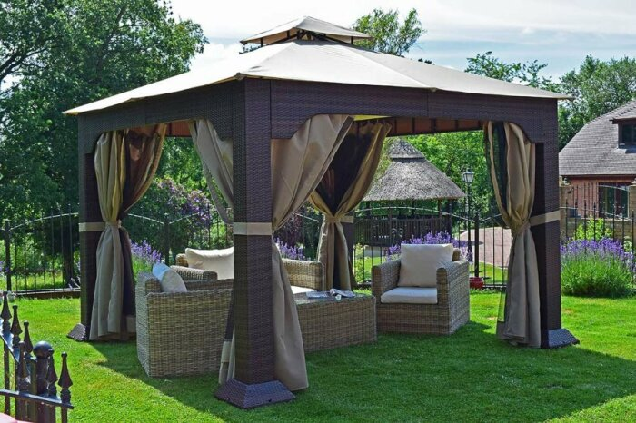
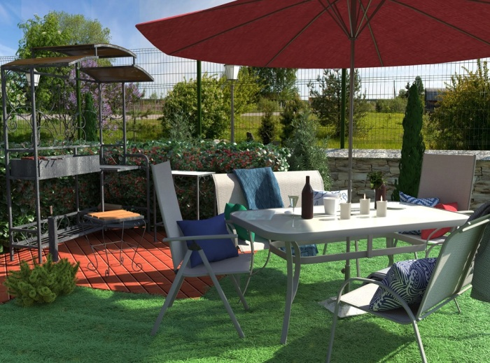
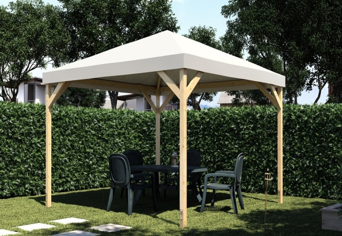
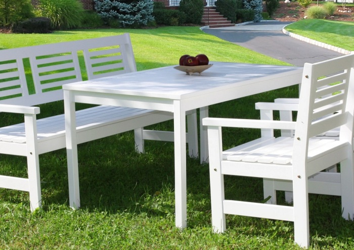
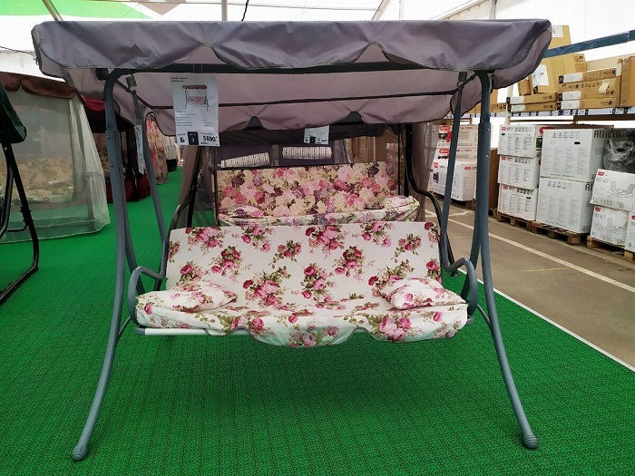

# Rest not work: making the dacha the perfect place to relax

Recently, the cottage is increasingly seen not as a place for exhausting work in the garden or new records in the garden, but as a place to relax, find inner harmony and unity with nature. The coronavirus is also to blame: the borders are closed, and this year the dacha will become the only opportunity to get away from the dusty and noisy city for a greater number of people. Leroy Merlin experts tell how to turn the dacha into a place where you can really have a good summer vacation, relax, unwind and gain strength for new achievements.

## An area with a barbecue or a charcoal grill

Grilling barbeque on the May holidays has become a good tradition for many people. When they do it in the forest or the park, as a rule, they are limited to the most simple collapsible metal construction. But in the country house is quite another matter; here we want to surround ourselves with comfort, so that the ritual of cooking was as comfortable and enjoyable as possible. Stationary grill, barbecue or barbecue will make the area for cooking meat or vegetables on fire not only functional but also beautiful.

## A pergola or a tent

To be able to arrange outside not only an improvised kitchen in the form of a barbecue or barbecue, but also an open dining area, put a gazebo, pavilion or tent on the plot. Of course, it is not necessary to use them only for eating - such buildings provide unprecedented space for all kinds of activities. You can just sit and contemplate nature or meditate, or you can read, play board games or just spend time with your loved ones, enjoying the fresh outdoor air and not afraid of the direct hot sun or summer rain.

## Garden Furniture

In order to organize an outdoor dining area or just an "outdoor living room", where you can gather with the whole family or with friends and have fun, you should buy a set of garden furniture: several sofas or armchairs, a table, benches or chairs. Garden furniture is made of materials that can safely withstand a long stay outdoors - plastic, treated with special compounds wood, artificial rattan, aluminum, etc. So you can not be afraid if it suddenly starts to rain - it will be enough to hide only soft cushions.

## Hammocks and swings

If you have two trees next to each other in your dacha, consider it a real good luck: you can fasten a hammock on them, on which it is so pleasant to lie and relax in the shade of lush crowns. Almost like in novels or old movies. But if there are no trees - no problem, you can buy a frame for the hammock and place it wherever you want: on a terrace or porch, under a large umbrella or a canopy. And in order to spend time swinging not alone, the garden swing is perfect: it can comfortably accommodate up to 4 people. Plus, many models are equipped with a mesh, protecting against insects, so that nothing can disturb your peace.

